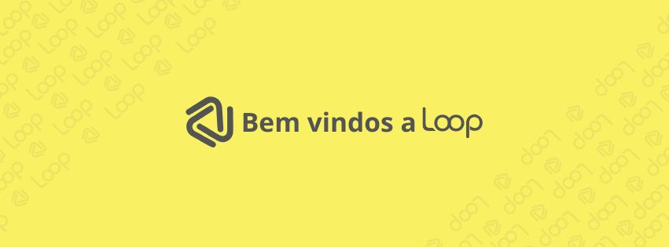

**Loop** é uma empresa dedicada ao desenvolvimento de soluções inovadoras para o setor de automação comercial. Nosso produto principal é o **Cardápio Loop**, uma plataforma digital para restaurantes, lojas e eventos, oferecendo uma experiência moderna e acessível para visualização de cardápios via QR Code. Este repositório contém o código e os recursos necessários para o desenvolvimento e manutenção do Cardápio Loop.

## Visão Geral do Projeto

O **Cardápio Loop** visa proporcionar aos estabelecimentos comerciais uma alternativa moderna para seus catálogos de produtos, permitindo que seus clientes acessem os cardápios de forma fácil e rápida por meio de dispositivos móveis.

Este repositório serve como o código principal para o desenvolvimento do produto, abrangendo tanto o **back-end** quanto o **front-end**, e integrações com a infraestrutura da plataforma.

## Objetivos do Projeto
- **Desenvolver uma plataforma simples e intuitiva** para visualização de cardápios digitais.
- **Fornecer uma solução baseada em assinatura**, com opções mensais e anuais.
- **Integrar com QR codes**, permitindo fácil acesso ao cardápio pelos clientes.
- **Garantir escalabilidade e segurança** através de uma arquitetura moderna em Kubernetes e múltiplas camadas de proteção.

## Tecnologias Utilizadas
- **Back-end**: .NET 8
- **Front-end**: HTML, CSS, JavaScript, TypeScript, React
- **Infraestrutura**: Kubernetes, Docker, Digital Ocean, Jenkins, Circle CI
- **Segurança**: AWS Secrets, CAPTCHAs, Certificados Mutuamente Assinados, Firewall
